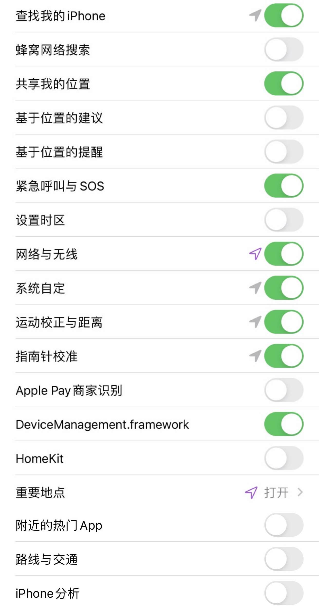
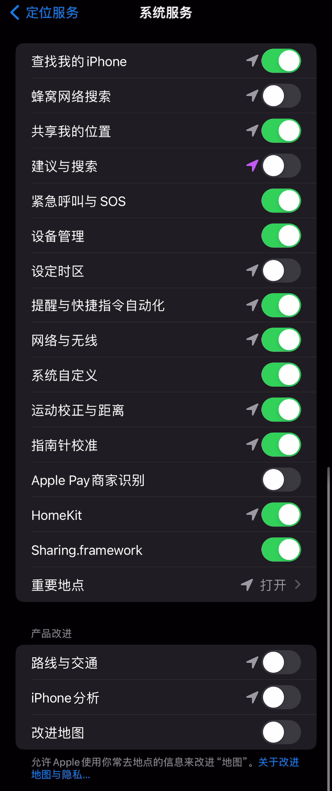

        

     
     
      
     
    
    

## 前言
 **欢迎🌟Star！❤️**  

 ⚠️ 注意： 自 iOS / iPadOS / macOS 26 起，苹果使用了更严格的检测机制来限制用户跨地域使用服务。包括但不限于：
 - 检测(附近) WiFi 路由器的国家代码；
 - SIM 卡信息（基站 / 运营商／国家识别）；
 - 当前 GPS 定位。
 
 **因此，若有浏览 Apple News 的需求请参照以下建议：**
 - 请将设备系统停留在 iOS / iPadOS 18.x 及以下版本，macOS 15.x.x 及以下版本。
 - 由于 iPhone 17 系列默认搭载 iOS 26，因此该捷径同样不适用于该系列产品。
 
 ## 特别声明

1. 请通过我国(中华人民共和国)合法的互联网出入口信道访问规则中的地址，并确保在使用过程中符合相关法律法规  
2. 分流规则是互联网公共服务的域名和IP地址汇总，所有数据均收集自开源项目，仅为解决引用过多外部资源引起的规则重复问题，不代表我们支持或使用这些服务。
3. 本项目内所有资源文件，禁止任何公众号、自媒体进行任何形式的转载、发布。
4. 编写本项目主要目的为学习和研究iOS捷径写法，无法保证项目内容的合法性、准确性、完整性和有效性。
5. 本项目涉及的数据由使用的个人或组织自行填写，本项目不对数据内容负责，包括但不限于数据的真实性、准确性、合法性。使用本项目所造成的一切后果，与本项目的所有贡献者无关，由使用的个人或组织完全承担。
6. 本项目中涉及的第三方硬件、软件等，与本项目没有任何直接或间接的关系。本项目仅对部署和使用过程进行客观描述，不代表支持使用任何第三方硬件、软件。使用任何第三方硬件、软件，所造成的一切后果由使用的个人或组织承担，与本项目无关。
7. 本项目中所有内容只供学习和研究使用，不得将本项目中任何内容用于违反国家/地区/组织等的法律法规或相关规定的其他用途。
8. 所有基于本项目源代码，进行的任何修改，为其他个人或组织的自发行为，与本项目没有任何直接或间接的关系，所造成的一切后果亦与本项目无关。
9. 所有直接或间接使用本项目的个人和组织，应24小时内完成学习和研究，并及时删除本项目中的所有内容。如对本项目的功能有需求，应自行开发相关功能。
10. 本项目保留随时对免责声明进行补充或更改的权利，直接或间接使用本项目内容的个人或组织，视为接受本项目的特别声明。

## 🧭 快速导航 
* 使用教程
  * [💻 Mac端教程](#-mac端-apple-news)
  * [📱 iOS/iPad教程](#-iosipad-apple-news)

* Tips
  * [👨🏻‍💻 使用说明](#%E2%80%8D-使用说明)
  * [❗️ 注意事项](#%EF%B8%8F-注意事项)
  * [⁉️ 常见报错](#%EF%B8%8F-常见报错)
  * [💁🏻‍ 分流地址]([#%E2%80%8D-分流地址))
  * [📍 iOS定位设定](#-ios定位设置图片)
## **演示地址**:   

# 💬 交流

                 
     
 

 

## 🔍查询您的Apple ID归属国家/地区是否提供该服务:

       
        
 

 
 
# 💻 Mac端 Apple-News  

1. 前往系统偏好设置 > 语言与地区 > 将地区更改为美国. Apple News的App将自动出现. 若Apple News图标未自动出现在桌面,可尝试前往: https://news.apple.com/ 点击免费试用一个月将自动跳转并出现App.  
2. 开启全局代理/使用分流 (**需要包括: HOST-SUFFIX,apple.com 并保持分流为最新**)  
3. 打开Mac端系统地图,系统将自动切换到TOMTOM提供的数据. 此时地图将自动刷新,左下角的高德地图标志将消失.  
4. 打开Apple News.  
5. Successful,Enjoy Apple News!🎉  

# 📱 iOS/iPad Apple-News    

**Feature:**
- 捷径已加入了版本更新检测,请使用以往版本的下载新捷径.  
- 提供使用Wi-Fi或蜂窝网络继续浏览的选项的捷径,同时自动关闭飞行模式   
- 解锁的同时Siri的搜索引擎也从百度变为了Google
- 理论上不会再出现: 提示不在服务范围内,点击「quit」退出再打开的app的操作,捷径运行完毕即可浏览内容.(**前提是必须等待WI-FI连接成功后才进入下一步**)  
 
**快捷指令地址:(更新时间:2025.09.021)**
-  **注: v2021.10.10 起完整版和简化版已合并为一个捷径**   
-  **快捷指令长期有效，若失效会及时更新。**  
-  **不适用于 iOS / iPadOS 26，详见本文档的「前言」部分**

             
 
             

  
 

**🐝 无线局域网版设备可无视该教程(因为系统只会在插卡的情况下,检测运营商的MCC代码.)**  

## 👨🏻‍💻 使用说明
*  若添加快捷指令时提示 "无法打开不受信任的快捷指令" 请先随便运行一个快捷指令并前往:设置 > 快捷指令 > 允许不受信任的第三方快捷指令.  
*  请设置手机地区与你ID订阅的Apple news地区一致`请于设置 > 通用 > 语言与地区里设置地区，如美区id就将地区设为美国，以此类推`.  
*  此快捷指令无法设置地区与定位设置.请按照图片内容设置定位选项。[点击查看定位设置图片](#-ios定位设置图片)   
*  捷径完成解锁后可以关闭飞行模式使用蜂窝数据继续浏览🥳.  
*  Enjoy Apple News!🎉  

### ❗️ 注意事项
  *  **双卡的用户如果遇到无法在非飞行模式下解锁请尝试切换到单卡模式,若依旧失败请反馈给我.**  
  *  **注意:该捷径运行后会将你的系统地图提供商从高德地图切换成国外的TOMTOM地图。(使用蜂窝数据打开系统地图即可还原，但已解锁的News将同时失效，如需再次使用请重新运行一遍快捷指令.)**  
  *  **⚠️节点需选择提供Apple-News服务的地区，否则打开后仍会提示你所在的国家或地区不支持该服务**  
  *  **若单独添加Apple News分流无效,可尝试添加Apple.list,里面包含了HOST-SUFFIX,apple.com可避免因遗漏导致无法使用.若还是提示不在服务区域应考虑节点问题.** 

> **👉 点击此脚本右上角"..."将此快捷指令添加到主屏幕，可更便捷使用。**  

### ⁉️ 常见报错  

1. **Apple News isn't supported in your current region.**  
*  未按照教程图片设置定位导致手机过早触发自动校准定位.  
*  使用过蜂窝网络进入系统自带地图或其他app曾调用过系统地图. 测试了10分钟官方的高德地图app可单独运行导航而不触发该错误.  
*  确保节点为服务地区的原生节点.`即被是被识别为家宽而非机房分配的ip`  
   
2. **Feed Unavailable,There may be a problem with the sever or network.Plase try again later.**  
*  此问题通常是网络环境导致,如已添加分流请更换节点后再试.  
 
### 💁🏻‍ 分流地址
 **请参考神机规则设置Apple News的分流(全局代理也行),建议分流添加完毕后关闭软件代理并重启代理软件以确保分流能正常工作。**  
  
| 软件下载地址 | News.list|
| :-: | :-: |
| [Surge 4](https://apps.apple.com/us/app/surge-4/id1442620678) / [Loon](https://apps.apple.com/us/app/loon/id1373567447) | [地址](https://raw.githubusercontent.com/blackmatrix7/ios_rule_script/master/rule/Surge/AppleNews/AppleNews.list) |
| [Shadowrocket](https://apps.apple.com/us/app/shadowrocket/id932747118) |[地址](https://raw.githubusercontent.com/blackmatrix7/ios_rule_script/master/rule/Shadowrocket/AppleNews/AppleNews.list) |
| [Quantumult X](https://apps.apple.com/us/app/quantumult-x/id1443988620) | [地址](https://raw.githubusercontent.com/blackmatrix7/ios_rule_script/master/rule/QuantumultX/AppleNews/AppleNews.list)  |
| [Clash(已兼容intel和M1版Mac)](https://github.com/Fndroid/clash_for_windows_pkg/releases) | [地址](https://raw.githubusercontent.com/blackmatrix7/ios_rule_script/master/rule/Clash/AppleNews/AppleNews.list)   

| Apple.list|
| :-: | 
 |[Quantumult X](https://raw.githubusercontent.com/blackmatrix7/ios_rule_script/master/rule/QuantumultX/Apple/Apple.list) / [Surge或Loon](https://raw.githubusercontent.com/blackmatrix7/ios_rule_script/master/rule/Surge/Apple/Apple.list) / [Clash](https://raw.githubusercontent.com/blackmatrix7/ios_rule_script/master/rule/Clash/Apple/Apple.listl) / [Shadowrocket](https://raw.githubusercontent.com/blackmatrix7/ios_rule_script/master/rule/Shadowrocket/Apple/Apple.list) |

# 📍 iOS定位设置图片 

**教程图片路径为: 设置 > 隐私与安全性 > 定位服务 > 下滑找到「系统服务」.(若iOS的GitHub app端无法显示图片请前往网页版,另外直连GitHub也有可能导致图片无法正常显示.)**  
# iOS 15
  

# iOS 17 
  

## Star History

