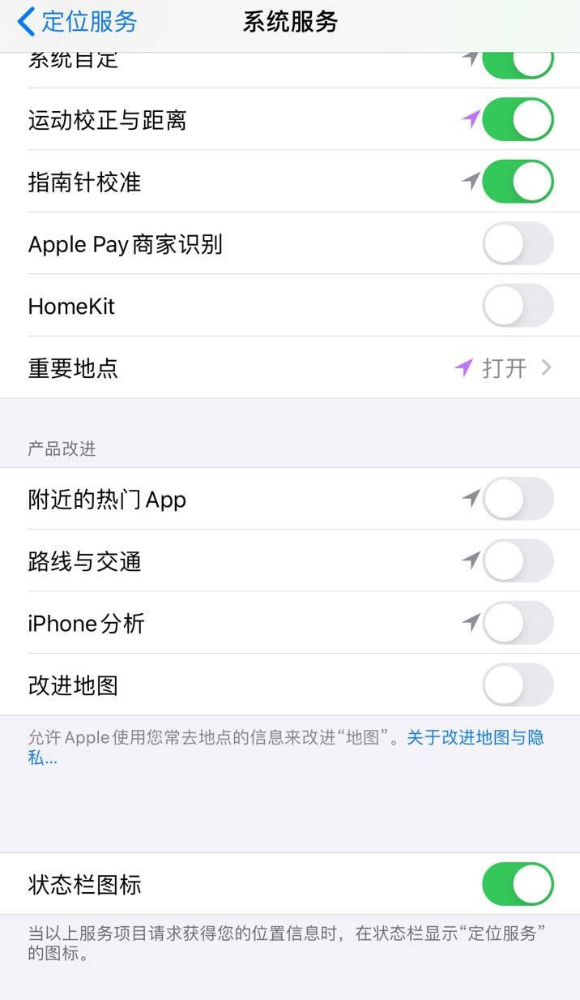

  

# 交流
讨论组:
频道:
反馈bot:

# 🔍查询您的Apple ID归属国家/地区是否提供该服务:
* **https://support.apple.com/zh-cn/HT204411**  

# 📱 iOS端 Apple-News:(更新时间:2020.10.11)    

**快捷指令地址:(为完成前置设置的用户提供简化版,去除了必要的前置设置提示,耗时缩短,节约生命🐶.从未使用过捷径的请先使用完整版)**  

* [完整版](https://www.icloud.com/shortcuts/e74e9d722beb45c78dfab7e47ed82465) / [简化版](https://www.icloud.com/shortcuts/381635d80b46402b953b85625ecc69ca)

**🐝 非蜂窝网络版设备可无视该教程(没有读取到你的SIM卡运营商)**  

**💻 Mac用户请往下翻**  

## 👨🏻‍💻 使用说明    
*  若添加快捷指令时提示 "无法打开不受信任的快捷指令" 请先随便运行一个快捷指令并前往:设置➡️快捷指令➡️允许不受信任的第三方快捷指令.  
*  请设置手机地区与你ID订阅的Apple news地区一致(请于设置➡️通用➡️语言与地区里设置地区，如美区id就将地区设为美国，以此类推).  
*  此快捷指令无法设置地区与定位设置.由于图片格式过长请前往教程底部查看，并按照图片内容设置定位选项。 
*  捷径完成解锁后可以关闭飞行模式使用蜂窝数据继续浏览🥳.  
*  Enjoy Apple News!🎉  

❗️ 注意事项
*  **注意:该捷径运行后会将你的系统地图提供商从高德地图切换成国外的TOMTOM地图。(使用蜂窝数据打开系统地图即可还原，但已解锁的News将同时失效，如需再次使用请重新运行一遍快捷指令.)**  
*  **脚本运行完成后自动打开那次通常会报错.请手动关闭News和系统自带地图后重新打开News即可正常浏览.（⚠️节点需选择提供Apple-News服务的地区，否则打开后仍会提示你所在的国家或地区不支持该服务）**  
*  **若解锁失败可先尝试完全关闭WI-FI开关再运行快捷指令**  

> 👉 点击此脚本右上角"..."将本快捷指令添加到主屏幕，可以更便捷使用该捷径。  

## ⁉️ 常见报错  

1. **Apple News isn't supported in your current region.**  
*  未按照教程图片设置定位导致手机过早触发自动校准定位.  
*  使用过蜂窝网络进入系统自带地图或其他app曾调用过系统地图. 测试了10分钟官方的高德地图app可单独运行导航而不触发该错误.  
*  确保节点为服务地区的原生节点.(即被是被识别为家宽而非机房分配的ip)  
   
2. **Feed Unavailable,There may be a problem with the sever or network.Plase try again later.**  
*  此问题通常是网络环境导致,如已添加分流请更换节点后再试.  
 
## 💁🏻‍ 请参考神机规则设置Apple News的分流(全局代理也行)  
 
搬运的Apple-News分流：  
* (适用于Quantumult X):https://raw.githubusercontent.com/DivineEngine/Profiles/master/Quantumult/Filter/Extra/Apple/News.list

* (适用于Surge/Loon): https://raw.githubusercontent.com/DivineEngine/Profiles/master/Surge/Ruleset/Extra/Apple/News.list

* (apple相关服务分流):  https://raw.githubusercontent.com/DivineEngine/Profiles/master/Surge/Ruleset/Extra/Apple/Apple.list

**Tips:⚠️ 分流添加完毕后请关闭软件代理并重启代理软件以确保分流能正常工作。**  

# 💻 Mac端 Apple-News:  

1. 前往系统偏好设置➡️语言与地区➡️将地区更改为美国. Apple News的App将自动出现. 若Apple News图标未自动出现在桌面,可尝试前往:https://news.apple.com/ 点击免费试用一个月将自动跳转并出现App.  
2. 开启全局代理/使用分流(需要包括map域名:DOMAIN,gspe21-ssl.ls.apple.com , DOMAIN,gspe1-ssl.ls.apple.com. **gspe后面的数字有时会变更导致分流失效,请保持分流为最新**)  
3. 打开Mac端系统地图,系统将自动切换到TOMTOM提供的数据. 此时地图将自动刷新,左下角的高德地图标志将消失.  
4. 打开Apple News.  
5. Successful,Enjoy Apple News!🎉  

* **若单独添加Apple News分流无效,可尝试添加Apple相关服务分流,里面包含了HOST-SUFFIX,apple.com可避免因遗漏导致无法使用.若还是不在服务区域应考虑节点问题.**

# 📍 iOS定位设置图片 

**教程图片路径为: 设置➡️隐私➡️定位服务➡️系统服务.(若iOS的GitHub app端无法显示图片请前往网页版,若直连GitHub也有可能导致图片无法正常显示.)**  

